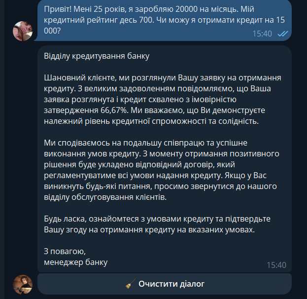

#  AI Loan Officer Agent (FastAPI + XGBoost + Llama 3.3)
Професійний Telegram-бот для автоматизації кредитного скорингу. Проект демонструє поєднання класичного машинного навчання (XGBoost) та сучасних LLM (Llama 3.3) для обробки природної мови (NLU).
[t.me/MyLoanOfficer_bot]() || Telegram 

##  Основна ідея
Користувач спілкується з ботом у Telegram. Система автоматично витягує потрібні дані з контексту розмови та миттєво проводить аналіз ризиків завдляки XGBoost.
##  Архітектура системи
Проект реалізований як багатомовний пайплайн:
1. **NLU Layer (Llama 3.3 via Groq):** Аналізує неструктурований текст користувача та конвертує його в JSON.
2. **Decision Layer (XGBoost):** Математична модель, навчена на історичних даних, яка обробляє чисельні ознаки та видає прогноз.
3. **Logic Layer (FastAPI):** Асинхронне ядро, що координує роботу бота, бази даних та ML-моделі.
4. **Persistence Layer (SQLite):** Зберігає історію діалогів, забезпечуючи «пам'ять» агента.
##  Технологічний стек
- **Backend:** Python, FastAPI, Uvicorn
- **AI/ML:** XGBoost, Pandas, Groq API (Llama 3.3 & 3.1)
- **Bot Framework:** Aiogram 3.x
- **Database:** SQLite3
- **DevOps:** Docker, Docker Compose
##  Як запустити проект
### 1. Налаштування середовища
Створіть файл `.env` та додайте ваші ключі:
TELEGRAM_BOT_TOKEN=ваш_токен
GROQ_API_KEY=ваш_ключ
### 2. Запуск через Docker (рекомендовано)
docker build -t loan-ai-bot .
docker run -p 8000:8000 --env-file .env loan-ai-bot
### 3. Локальний запуск
pip install -r requirements.txt
uvicorn main:app --reload
## Про модель XGBoost
Модель була попередньо навчена (Pre-trained) на датасеті кредитних історій. 
Вона враховує 4 ключові фактори: вік, дохід, суму кредиту та кредитний рейтинг. 

